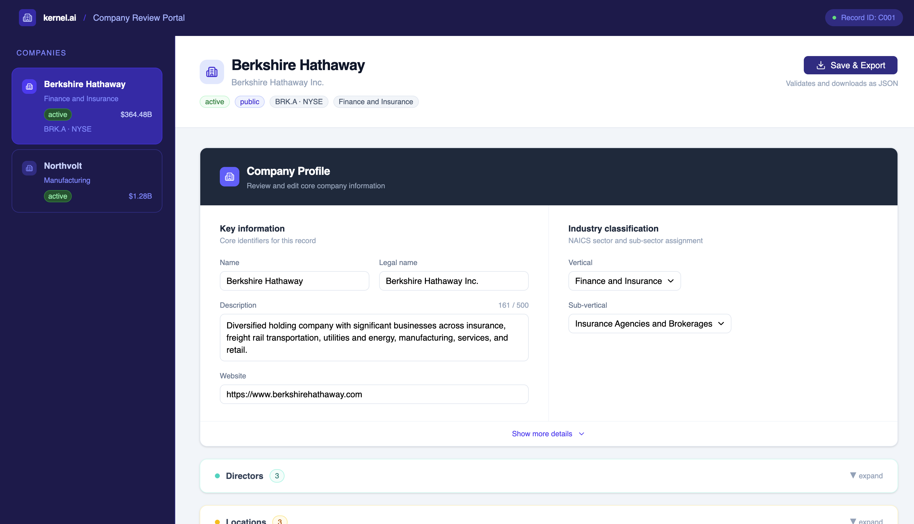

# Company Review Portal

A production-ready React application for reviewing and editing company records.



## Setup

```bash
npm install
npm run dev
```

Then open http://localhost:5173

## Tests

```bash
npm test
```

## Build

```bash
npm run build
npm run preview
```

## Philosophy

This project went through two iterations. The first was intentionally minimal —
clean logic, flat structure, no dependencies that didn't earn their place. After
feedback, the second iteration pushed further on design sense, modern tooling,
and production-ready patterns while keeping the same core principles: readable
code, clear structure, and a UI that feels like a real product an analyst would
actually want to use.

As a product engineer I care about the experience on both sides: the end user
gets a fast, no-friction tool, and the next engineer to open the codebase can
understand it immediately without digging through layers of configuration or
indirection.

## Tech decisions

**React + Vite, not Next.js**
This is a single-page client-only tool with no routing, no server, and no
data fetching. Next.js would add complexity with zero benefit. Vite gives
instant dev startup and a clean production build with no configuration needed.

**TypeScript**
The first submission used plain JavaScript. After feedback requesting modern
web technologies, TypeScript was the right call — not because the data shape
is complex, but because explicit interfaces on `Company`, `Director`,
`Location` and `ValidationErrors` make the codebase self-documenting and
catch mistakes at compile time rather than runtime. Every prop, function
signature and return type is typed throughout.

**shadcn/ui + Tailwind CSS**
Plain CSS worked for the first submission but didn't meet the bar for a
polished, production-ready product. shadcn/ui is the current industry standard
for React component libraries — it is unstyled by default, built on Tailwind,
and gives full control over every component. The result looks and feels like
a real SaaS product without fighting library opinions.

**No validation library (no Zod, no Yup)**
There are five business rules in the spec. They are written as plain functions
in `src/utils/validation.ts` — one function per entity, returning a typed
errors object. This is readable, easy to test, and easy to extend. The
structure is compatible with Zod if the project grew and schema inference
became valuable.

**Custom hook for state logic**
All state logic lives in `src/hooks/useCompany.ts` rather than directly in
`App.tsx`. This keeps the component tree clean and makes the logic easy to
test in isolation. It also makes it trivial to swap the data source — replace
the `useState` with a `useQuery` and the components don't change at all.

**No state management library (no Redux, no Zustand)**
The component tree is shallow — three sections, one page, one selected
company. Lifting state to a global store would be indirection for its own
sake. The custom hook gives all the benefits of isolated state logic without
the overhead of a library.

**Master-detail layout**
The mock data contains multiple company records. Rather than building a
single-record form, the UI uses a master-detail pattern — company list on
the left, detail panel on the right. This is how real analyst tools work
(Salesforce, HubSpot, Linear) and it shows the app was designed for a
workflow, not just a spec.

**Validation on export, live after first attempt**
Errors are shown only after the user first clicks Save & Export — not on
every keystroke, which would be noisy on a fresh form. After that first
attempt, validation runs live as they type so they get immediate feedback
while correcting mistakes.

**Sonner for toast notifications**
Export success and failure are communicated via toast notifications rather
than inline banners alone. Sonner is the standard toast library in the
shadcn ecosystem — lightweight, accessible, and zero configuration.

**Collapsible sections**
Directors and Locations are collapsed by default. The company profile is the
primary review surface — collapsing secondary sections reduces visual noise
and lets the analyst focus on the most important data first.

**Unit tests with Vitest**
All business logic in `src/utils/validation.ts` is covered by unit tests.
35 tests across `validateCompany`, `validateDirector`, `validateLocation`,
`formatRevenue` and the type guard utilities. Run with `npm test`. Testing
the validation layer specifically makes sense because it contains all the
business rules — if those break, the entire export flow breaks.

## Structure

```
src/
  data/
    mock-data.json          # source data, loaded at startup
  hooks/
    useCompany.ts           # state logic, validation, export
  utils/
    validation.ts           # business rule validation + formatRevenue
    export.ts               # JSON download helper
  components/
    ui/                     # shadcn components
    CompanyProfile.tsx      # grouped form with character count
    Directors.tsx           # director list, add/remove, two-column layout
    Locations.tsx           # location list, add/remove, two-column layout
    CompanyList.tsx         # master list sidebar with revenue + status
  types.ts                  # shared TypeScript interfaces
  App.tsx                   # layout, routing between companies
  index.css                 # Tailwind + dropdown fixes
```

## Business rules implemented

1. `vertical` must match a valid NAICS sector from the reference data
2. `subVertical` must belong to the selected vertical and resets when vertical changes
3. If `fundingStage` is `public`, ticker and stockExchange are shown and required
4. If `fundingStage` is not `public`, ticker and stockExchange are hidden and excluded from the export
5. At least one director and one location must be present at all times
6. Each location `countryCode` must be a valid ISO 3166-1 alpha-2 code